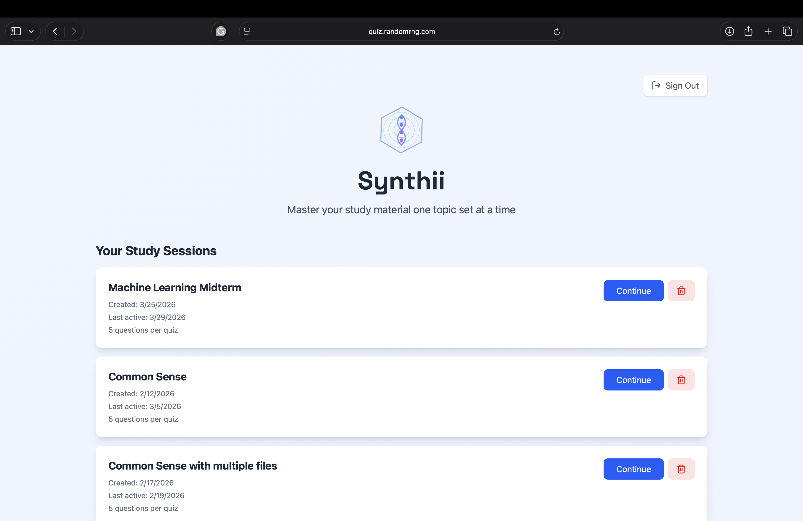
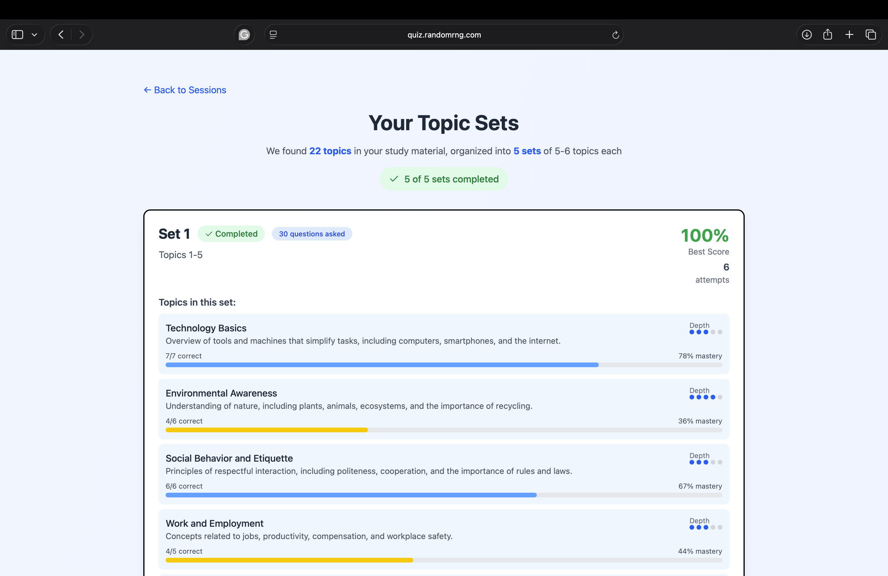
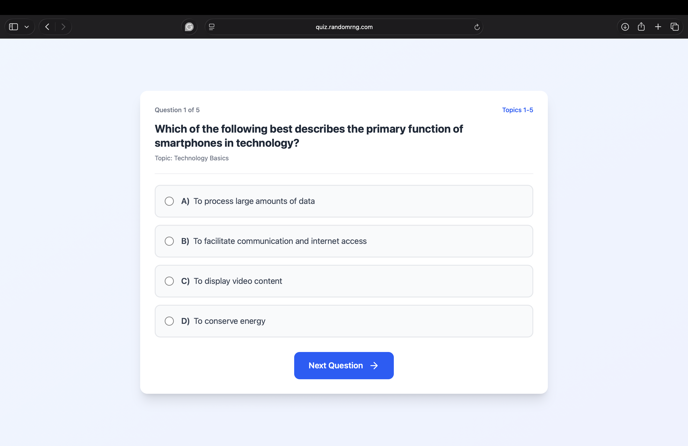
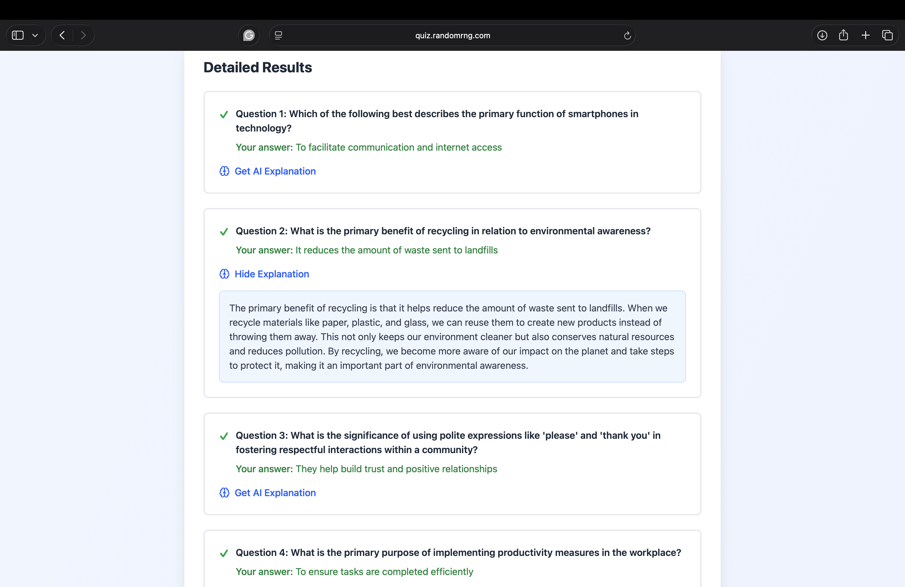

# Synthii — AI-Powered Adaptive Quiz App

**Transform any study notes into smart, personalized quizzes that adapt to your knowledge gaps.**

[🌐 Live Demo](https://quiz.randomrng.com)  
[📹 Demo Video](https://loom.com/your-video) 

## ✨ Highlights

- AI automatically extracts **all topics** from uploaded notes/PDFs and groups them into focused sets
- **Mastery tracking** with weighted topics and persistent progress via Supabase
- **Unique questions every time** — never repeats previously asked questions
- Adaptive follow-up quizzes that target weak areas
- Real-time AI explanations for every question
- Google OAuth login with session saving/resuming

Built solo to demonstrate full-stack development with modern AI integration.

## 🛠️ Tech Stack

**Frontend**
- React 18 + Vite
- Tailwind CSS
- Supabase Auth
- Lucide icons

**Backend**
- Node.js + Express
- OpenAI GPT-4o-mini (with request queuing, caching, and memory optimizations)
- Supabase PostgreSQL
- File processing (PDF, DOCX, PPTX support)

## 📸 Screenshots

## 📂 Repository Contents

- **`frontend/`** — Complete React source code (UI, state management, API calls)
- **`backend/`** — Express server with OpenAI integration, prompt engineering, and database logic
- **`screenshots/`** — Visual walkthrough of the user experience

## Why I Built This

As a student, I wanted a better way to study than static flashcards. Synthii uses AI to create **personalized, adaptive quizzes** from any material, while tracking long-term mastery.

Key technical challenges solved:
- Preventing question repetition using Supabase-stored history
- Efficient OpenAI usage (queuing + caching to handle rate limits and costs)
- Intelligent topic grouping and weighted mastery calculation
- Seamless progress persistence across sessions

The live app is fully hosted and functional. Feel free to test it at the link above!

## Future Ideas
- Spaced repetition system based on mastery data
- Support for image-based questions
- Progress export features

---

**Solo full-stack project showcasing React, Node.js, OpenAI API integration, and educational application design.**

## 📝 Note for Developers

This repository is primarily a **portfolio showcase** of my work. 

The code is provided under the MIT License, meaning you are free to use, modify, and learn from it. However, I kindly ask that you:
- Do not host a publicly accessible version of this app without significant original changes.
- Give appropriate credit if you use large portions of the code in your own projects.

The live version is actively maintained at [https://quiz.randomrng.com]